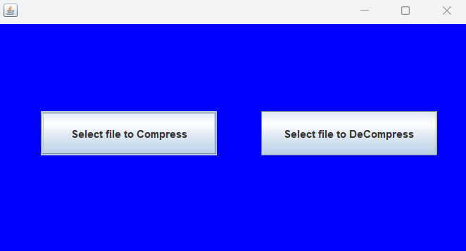
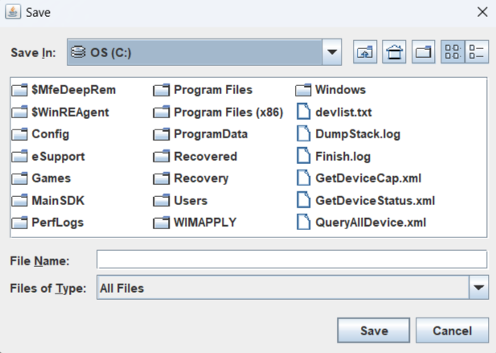

# Compressor-Decompressor
A simple project where files can be compressed or decompressed(only gz format) using gzip package in java.

Simple Click of buttons either Compress or Decompress then select files to get your desired output.

